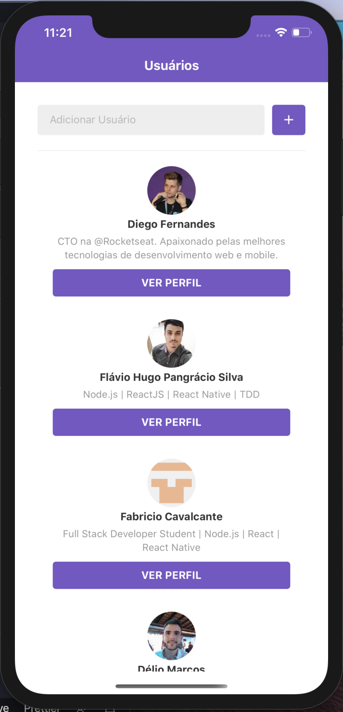
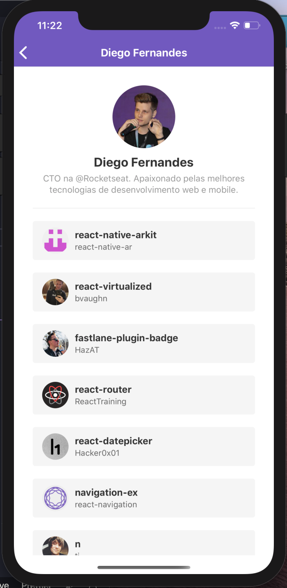
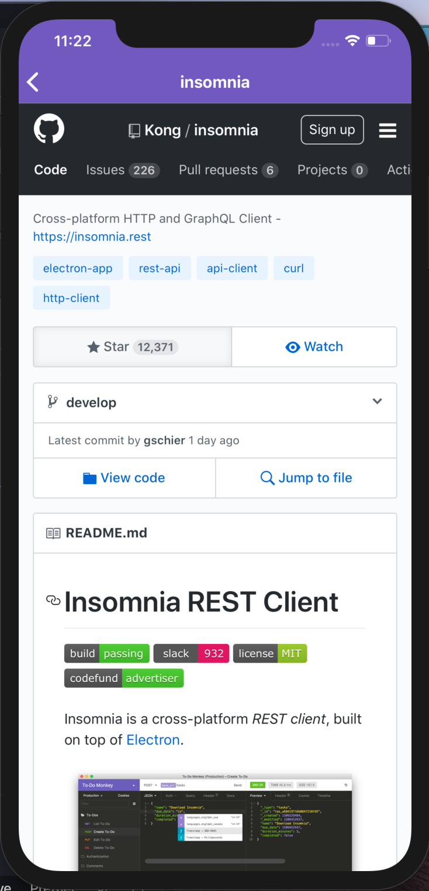
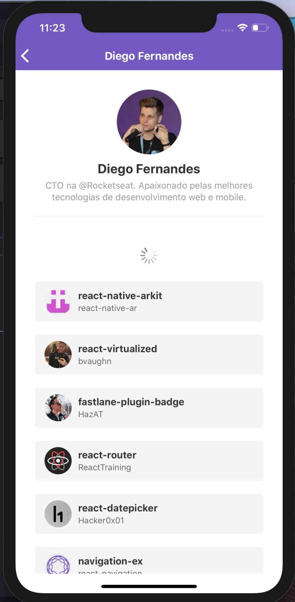

<h1 align="center">
    
</h1>

# Desafio com React Native
Esse app, desenvolvido com React Native, é a solução de um desafio proposto pela [Rocketseat](https://www.rocketseat.com.br)  🚀.

## Descrição:

O app consome a [API do Github](https://developer.github.com/v3/) para adicionar Usuários e listar os repositórios favoritos.

---
### Para essa aplicação, foram utilizados:
- [React](https://github.com/facebook/react)
- [React Native](https://github.com/facebook/react-native)
- [Styled Components](https://github.com/styled-components/styled-components)
- [React Navigation  v5.0.1](https://reactnavigation.org/)

### No desenvolvimento:
- [ESlint](https://github.com/eslint/eslint)
- [Prettier](https://github.com/prettier/prettier)

---
<h1 align="center">
  
  &nbsp &nbsp &nbsp
  
</h1>
 
<h1 align="center">
  
  &nbsp &nbsp &nbsp
  
</h1>

---
[Link para o desafio](https://github.com/Rocketseat/bootcamp-gostack-desafio-06)

---